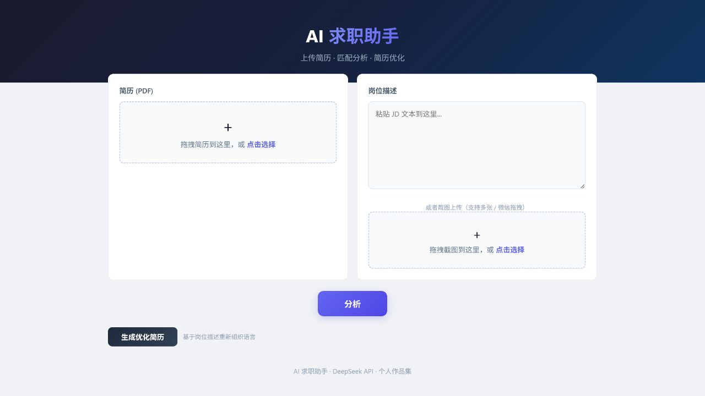

# AI 求职助手

面向实习与校招场景的简历–岗位匹配工具。用户上传 PDF 简历并输入岗位描述（JD）后，系统调用 DeepSeek 生成结构化匹配分析，也可以在不改动事实的前提下生成针对岗位的简历改写稿。

[](https://github.com/zhangzhangwudi2-creator/aiqiuzhizhe/actions/workflows/tests.yml)
[](https://www.python.org/)
[](https://fastapi.tiangolo.com/)
[](https://aiqiuzhizhe-production.up.railway.app/)

**[在线体验](https://aiqiuzhizhe-production.up.railway.app/)** · **[查看自动测试](https://github.com/zhangzhangwudi2-creator/aiqiuzhizhe/actions)**



## 项目亮点

- **真实业务闭环**：PDF简历与JD输入 → DeepSeek结构化分析 → 针对岗位生成改写稿。
- **成本保护**：按IP限流，并缓存相同输入6小时，减少重复API费用。
- **可靠输出**：使用Pydantic校验模型返回的分数、字段和枚举值。
- **隐私边界清楚**：截图OCR留在浏览器端；服务端不持久化PDF，并明确披露文本会发送至DeepSeek。
- **可重复验证**：14项Pytest测试（含接口与缓存链路）、3条带人工期望标签的离线质量评测和GitHub Actions持续集成。

## 处理流程

```text
PDF简历 ──> PyPDF提取文字 ──┐
                            ├──> 输入校验 ──> 限流/缓存 ──> DeepSeek
JD文本/截图 ──> 浏览器OCR ──┘                            │
                                                         v
                             Pydantic校验 <── JSON结构化分析
```

## 在线功能

- PDF 简历解析与内容长度控制
- JD 文本输入，或在浏览器端使用 Tesseract.js 识别多张截图
- 匹配度、优势、技能缺口、简历建议和面试问题的结构化分析
- 针对目标岗位生成简历改写稿
- 复制改写结果，或下载 Word 兼容的 `.doc` 文件
- 无需注册；服务端不持久化简历文件
- 同一输入结果缓存 6 小时，重复查看不再次消耗模型额度
- 默认每个 IP 每小时最多 5 次未命中缓存的 AI 调用

## 数据与隐私

- JD 截图的 OCR 在浏览器内执行，截图不会上传到服务端。
- PDF 会上传到本服务以提取文字，但不会被持久化保存。
- 提取出的简历文字和 JD 会发送给 DeepSeek API 完成分析或改写。
- 请勿上传身份证号、家庭住址等完成岗位分析不需要的敏感信息。

## 技术栈

- 后端：Python、FastAPI、AsyncOpenAI
- 模型：DeepSeek `deepseek-chat`
- PDF：PyPDF
- OCR：Tesseract.js（浏览器端）
- 前端：原生 HTML、CSS、JavaScript
- 部署：Railway / Nixpacks
- 测试：Pytest

## 当前架构

```text
.
├── main.py                # 当前部署入口与 API
├── prompts.py             # 分析、改写 Prompt
├── static/
│   └── index.html         # 当前线上前端
├── tests/
│   └── test_main.py       # 核心输入校验测试
├── evaluation/            # 不调用 API 的结构评测样例
├── scripts/
│   └── evaluate_outputs.py
├── requirements.txt
├── requirements-dev.txt
├── .env.example
└── nixpacks.toml
```

仓库中的 `backend/` 和 `frontend/` 是早期未完成的架构实验，不属于当前部署版本，其中包含模拟存储和模拟响应。为保留演进记录暂未删除，后续会在确认迁移价值后归档或移除。

## 本地运行

需要 Python 3.10 或更高版本。

```bash
python -m venv .venv
```

Windows PowerShell：

```powershell
.\.venv\Scripts\Activate.ps1
pip install -r requirements.txt
Copy-Item .env.example .env
```

在 `.env` 中填写：

```dotenv
DEEPSEEK_API_KEY=your_deepseek_api_key
```

启动：

```powershell
python main.py
```

访问 `http://localhost:8000`。

## API

| 方法 | 路径 | 说明 |
|---|---|---|
| `GET` | `/` | 前端页面 |
| `POST` | `/analyze` | 简历与 JD 匹配分析 |
| `POST` | `/rewrite-resume` | 针对 JD 改写简历 |
| `GET` | `/health` | 服务和 AI 配置状态 |

上传限制：PDF 最大 10MB；提取后的简历最多使用 30,000 字符；JD 最多 15,000 字符。

## 测试

```powershell
pip install -r requirements-dev.txt
pytest -q
```

测试覆盖空 JD、超长 JD、错误文件类型、损坏 PDF、无文字 PDF，以及使用模拟模型响应的 `/analyze` 接口与缓存复用链路。

不消耗模型额度的离线输出质量评测：

```powershell
python scripts/evaluate_outputs.py
```

评测集为每类岗位保存人工编写的期望标签，包括合理分数区间、必须覆盖的关键点和禁止编造的成果。脚本同时检查 Pydantic 输出契约、关键点召回率和不实表述；当前样例用于验证评测流程，不替代真实用户评价。

## 后续计划

- 扩充到 20 条匿名化岗位样本，对比不同 Prompt 版本
- 将单机内存限流升级为持久化限流（适用于多实例部署）
- 增加浏览器端到端测试
- 归档未使用的旧版目录
